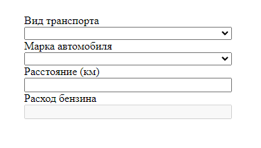
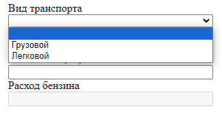
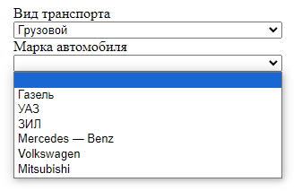
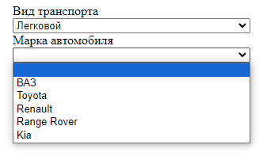
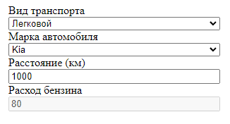

# Gasoline_consumption_AJAX
Асинхронный расчет расхода бензина 

Начальная страница:

В выпадающий список добавляются все виды транспорта из Базы Данных:

По тому, какой выбран вид, добавляются марки автомобилей:

Результат при введенных данных:

Структура таблицы transport:

---

*02/2023 - 06/2023*
